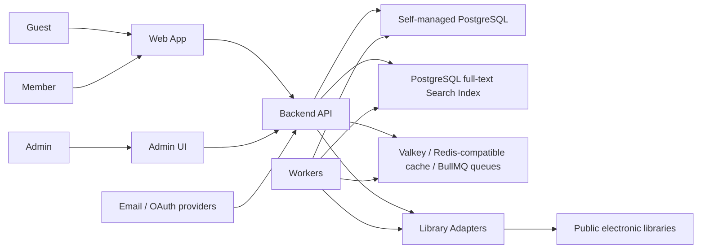

# eLibrary Architecture

This file owns HOW eLibrary is built: components, interfaces, data flow, module boundaries, architecture rationale, and unresolved architecture decisions. Product behavior belongs in [REQUIREMENTS.md](./REQUIREMENTS.md). Security controls and trust-boundary enforcement belong in [SECURITY.md](./SECURITY.md).

## Required Architecture Inputs

- `Requirements source: REQUIREMENTS.md`
- `Security source: SECURITY.md`
- `Design source: DESIGN.md`
- `System purpose: eLibrary helps users search public electronic-library ebooks, view holdings/availability, manage usable libraries, and continue to external borrowing flows.`
- `Primary use cases: library directory, ebook search, ebook detail and holdings, user library registration, personalized search/detail views, external borrowing redirect, admin integration/catalog operations.`
- `Target users / actors: Guest, Member, Admin, System worker.`
- `Runtime environment: web and API application`
- `Server framework: NestJS`
- `Client framework: React`
- `Package manager: pnpm for JavaScript/TypeScript workspace and lockfile management`
- `API style and integration model: REST-style API endpoints are used; external library integrations are isolated behind LibraryAdapter methods: searchBooks, getBookDetail, getAvailability, getLoanUrl.`
- `Authentication boundary: Auth module exists; member sign-in supports email plus Google, Apple, Kakao, and Naver social/OAuth providers; supported OAuth identities are automatically linked to existing email accounts only when SECURITY.md account-linking conditions are satisfied; Admin MFA uses application-managed TOTP compatible with Google Authenticator.`
- `Data model expectations: users, user_preferences, user_libraries, saved_books, recent_searches, libraries, integration_events, ebooks, ebook_aliases, holdings, availability_snapshots, loan_attempts, notification_preferences, notifications, push_subscriptions, audit_events, adapter configuration.`
- `Search index implementation: PostgreSQL full-text search for MVP.`
- `Worker queue implementation: BullMQ through @nestjs/bullmq using a self-managed Valkey or Redis-compatible service for MVP worker queues.`
- `Metadata source baseline: initial ebook metadata comes from public electronic-library APIs and public ISBN/book metadata sources; exact providers and adapter mappings remain unresolved until first libraries are selected.`
- `Borrowing model: external redirect/handoff is the baseline; internal API-based borrowing is allowed for approved library APIs; external-library automatic borrowing or account linking is allowed only under SECURITY.md credential-handling controls.`
- `Notification model: saved-book and availability-change notifications use email, Web Push, and in-app channels; email and Web Push delivery provider selection and credential ownership are deferred.`
- `External library API key ownership: Admins register and rotate external library API keys from service settings while creating or editing integrated libraries.`
- `Deployment target: zero-cost MVP/demo deployment on Oracle Cloud Always Free using a single Arm/Ampere VM with Docker Compose, self-managed PostgreSQL, self-managed Valkey or Redis-compatible cache and BullMQ queues, and Caddy or Nginx with Let's Encrypt for HTTPS. This is not production-grade until backup, patching, monitoring, recovery, and capacity risks are explicitly accepted.`
- `Observability stack: no-cost baseline using container/application logs, health checks, and OCI Always Free Logging, Monitoring, Notifications, and Application Performance Monitoring where available. Paid external observability services are out of scope for the zero-cost deployment.`
- `Performance and degraded-integration behavior: REQUIREMENTS.md owns NFR-1.`
- `Security expectations: SECURITY.md owns SR-001 through SR-015, STRIDE review, and trust-boundary enforcement.`

## Initial Architecture

Use a modular monolith baseline with separate runtime units for the Web App, Admin UI, Backend API, Workers, Library Adapters, self-managed PostgreSQL, PostgreSQL full-text Search Index, self-managed Valkey or Redis-compatible cache, and BullMQ worker queues. Keep module interfaces explicit so workers, adapters, or search can later be split without changing product behavior.



Runtime components:

| Component | Responsibility |
| --- | --- |
| Web App | React public/member UI for library browsing, ebook search/detail, member library registration, personalization, external borrowing handoff |
| Admin UI | React admin UI for library, integration status, duplicate metadata, audit, and integration-event operations |
| Backend API | NestJS REST request handling, validation, orchestration, persistence, and response shaping; deployed as a Docker Compose service for zero-cost MVP/demo |
| Workers | NestJS-compatible worker runtime using BullMQ via `@nestjs/bullmq` for metadata sync, holdings sync, availability refresh, search indexing, notification dispatch, integration health checks; deployed as Docker Compose worker services for zero-cost MVP/demo |
| Library Adapters | Per-library implementation of `searchBooks`, `getBookDetail`, `getAvailability`, and `getLoanUrl` |
| PostgreSQL | Self-managed PostgreSQL primary store for persisted user, catalog, holding, activity, integration, audit data, and MVP full-text search structures |
| Search Index | PostgreSQL full-text search indexes or projections over normalized public ebook metadata |
| Valkey / Redis-compatible cache | Self-managed Valkey or Redis-compatible cache, rate/workload counters, and BullMQ worker queues |

Deployment baseline:

- MVP/demo deployment target is Oracle Cloud Always Free with a single Arm/Ampere VM.
- Dockerized runtime services run through Docker Compose on the VM.
- PostgreSQL runs as a self-managed service and stores primary data plus PostgreSQL full-text search structures.
- Valkey or a Redis-compatible service runs as a self-managed service for cache data and BullMQ operational state.
- Caddy or Nginx terminates HTTPS with Let's Encrypt certificates.
- This zero-cost target is not production-grade until backup, patching, monitoring, recovery, and capacity risks are explicitly accepted.
- Public ingress, private networking, host hardening, secrets, encryption, and backup controls are owned by `SECURITY.md`.

Observability baseline:

- Container and application logs are the mandatory local baseline.
- OCI Always Free Logging, Monitoring, Notifications, and Application Performance Monitoring MAY be used where available without creating paid services.
- Health checks MUST cover the web/API process, workers, PostgreSQL, Valkey or Redis-compatible cache, and public HTTPS endpoint.
- Paid external observability services are out of scope for the zero-cost deployment.
- Minimum custom telemetry includes API latency, error rate, request count, search/detail/loan-attempt latency, adapter error rate by library, BullMQ queue depth, failures, retries, notification dispatch failures, auth/admin/audit-event failure spikes, and PostgreSQL/cache/host health.

Module boundaries:

| Module | Owns | Notes |
| --- | --- | --- |
| Auth | user identity, sign-in state, role identity handoff | Security controls are in `SECURITY.md`. |
| User | users, user_preferences, user_libraries, saved_books, recent_searches | Owns member-owned account activity and personalization workflows. |
| Library | libraries, public directory fields, integration status | Owns link-only vs integrated library records. |
| Ebook | ebooks, ebook_aliases, identifier merge keys | Owns normalized ebook metadata and duplicate resolution inputs. |
| Holding | holdings, availability_snapshots | Owns library-specific ownership and availability states. |
| Loan | loan_attempts | Owns external borrowing handoff records. |
| Notification | notification_preferences, notifications, push_subscriptions, notification delivery jobs | Owns member notification preferences, in-app notification records, Web Push subscriptions, and channel dispatch. |
| Admin | admin-facing library/catalog/integration operations | Delegates audit writes to Audit. |
| Integration | adapter configuration, adapter secret references, adapter capability dispatch, integration_events | Owns external library sync and health outcomes. |
| Audit | audit_events | Owns append-only event capture for actions that need investigation. |

Modules must interact through service interfaces. A module must not directly mutate another module's owned records.

Initial REST surface:

Authentication routes must be finalized with the selected auth approach before implementation. Auth routes must not place passwords, OAuth codes, session tokens, or refresh tokens in application logs or user-visible URLs; SECURITY.md owns detailed auth controls.

```http
GET /api/libraries
GET /api/libraries/{libraryId}
GET /api/ebooks/search
GET /api/ebooks/{ebookId}
GET /api/ebooks/{ebookId}/holdings
GET /api/me
GET /api/me/preferences
PATCH /api/me/preferences
GET /api/me/libraries
POST /api/me/libraries
PATCH /api/me/libraries/{userLibraryId}
DELETE /api/me/libraries/{userLibraryId}
GET /api/me/saved-books
DELETE /api/me/saved-books/{savedBookId}
GET /api/me/recent-searches
DELETE /api/me/recent-searches/{searchHistoryId}
POST /api/holdings/{holdingId}/loan-attempts
GET /api/me/loan-attempts
GET /api/me/notification-preferences
PATCH /api/me/notification-preferences
GET /api/me/notifications
PATCH /api/me/notifications/{notificationId}
POST /api/me/push-subscriptions
DELETE /api/me/push-subscriptions/{pushSubscriptionId}
GET /api/admin/libraries
POST /api/admin/libraries
PATCH /api/admin/libraries/{libraryId}
POST /api/admin/libraries/{libraryId}/api-key-rotations
POST /api/admin/libraries/{libraryId}/sync
GET /api/admin/integration-events
GET /api/admin/audit-events
```

Data flow rules:

- To support `NFR-1`, search uses PostgreSQL full-text search indexes or projections, then adds cached availability summaries when present.
- Worker jobs use BullMQ through `@nestjs/bullmq`, with separate queues for `metadata-sync`, `availability-refresh`, `search-indexing`, `notification-dispatch`, and `integration-health`.
- Missing or stale availability schedules worker refresh instead of live blocking the user response.
- Detail pages read persisted holdings and cached availability first, then enqueue stale availability refresh where useful.
- Member-registered library inputs can influence query ordering and availability refresh scheduling.
- Search result display layout defaults to card; Members persist layout through the User module, while Guests may keep the last selected layout in browser-local state when available.
- Borrowing resolves the holding and library server-side and creates a `loan_attempt`.
- Redirect-based borrowing asks the relevant adapter for `getLoanUrl`, validates the adapter URL against the selected library, and returns the destination library plus approved external URL or normalized destination when known.
- Internal API-based borrowing may call an approved adapter capability only when the selected library supports that API and SECURITY.md controls are satisfied; it must still record a `loan_attempt` outcome and preserve source provenance.
- Availability changes and saved-book events enqueue notification evaluation; the Notification module applies member preferences and dispatches email, Web Push, and in-app notifications without blocking search or detail responses.
- Admin integration changes update PostgreSQL and emit audit/integration events.
- Admins register or rotate external library API keys from service settings while creating or editing integrated libraries; the Integration module stores only protected secret material or secret references according to `SECURITY.md`.

External normalization and provenance:

- External library data enters only through Library Adapters and normalization code.
- Ebook, holding, availability, and redirect records preserve source library, external record ID, adapter version, fetched time, and normalized time when available.
- PostgreSQL is the authority for persisted records.
- Valkey or Redis-compatible cache, BullMQ operational state, and PostgreSQL full-text search indexes or projections are derived stores and must be rebuildable from PostgreSQL plus external refresh jobs.
- The full-text Search Index stores public ebook metadata and derived public catalog data only; member-owned activity remains in PostgreSQL behind API authorization.
- Worker job payloads carry internal IDs and job parameters only; workers load adapter configuration server-side for the specific library job.
- Conflicting external records must preserve provenance for admin review instead of overwriting source context.
- Stale or unknown availability must stay distinguishable from confirmed current availability.

Trust boundaries:

- Browser to Web App
- Web App to Backend API
- Admin UI to Backend API
- Email/OAuth provider to Backend API
- Backend API to data stores
- Backend API or Worker to external libraries
- Backend API or Worker to email and Web Push delivery providers
- External library metadata to normalization pipeline
- Worker to adapters
- CI/CD to runtime environments

Trust-boundary enforcement is defined in [SECURITY.md#trust-boundary-enforcement](./SECURITY.md#trust-boundary-enforcement).

## Requirement Traceability

| Requirement group | Architecture support |
| --- | --- |
| `FR-1 Public Library Directory` | Web App, Backend API, Library module, PostgreSQL `libraries`, Admin UI for library maintenance |
| `FR-2 Ebook Search and Discovery` | Web App, Backend API, Ebook module, User module for display preferences, PostgreSQL full-text Search Index, PostgreSQL `ebooks`, `ebook_aliases`, and `user_preferences`, cache availability summary |
| `FR-3 Ebook Detail, Holdings, and Availability` | Ebook and Holding modules, PostgreSQL `holdings` and `availability_snapshots`, cache, Workers, Library Adapters |
| `FR-4 Member Libraries and Personalization` | User module, PostgreSQL `user_libraries`, Web App personalization, Backend API member endpoints |
| `FR-5 Borrowing Redirect` | Loan module, Holding module, `LibraryAdapter.getLoanUrl`, PostgreSQL `loan_attempts` |
| `FR-6 Member Account and Activity` | Auth and User modules, member API endpoints, PostgreSQL `users`, `saved_books`, `recent_searches`, `loan_attempts` |
| `FR-7 Admin Operations` | Admin UI, Admin module, Library module, Integration module, Ebook module duplicate-review support, Audit module |
| `FR-8 Operational Visibility` | Workers, Integration module, Audit module, cache workload indicators, PostgreSQL `integration_events` and `audit_events`, local logs, health checks, OCI no-cost observability where available |
| `FR-9 Member Notifications` | Notification module, User module, Holding module availability events, Workers, PostgreSQL `notification_preferences`, `notifications`, and `push_subscriptions` |
| Security requirements | `SECURITY.md` owns SR-001 through SR-015, STRIDE review, and trust-boundary enforcement |

Unresolved architecture decisions are listed in `Open Architecture Questions`.

## Dependency Rationale

- Do not add a dependency when the standard library or a few lines of first-party code will do.
- Prefer zero new dependencies while the project is in bootstrap mode.
- Use pnpm workspaces once package manifests exist; commit `pnpm-lock.yaml`.
- BullMQ and `@nestjs/bullmq` are approved architecture dependencies for Redis-compatible worker queues because persisted job state, retry/backoff, delayed jobs, lifecycle events, and NestJS integration are required.
- Prefer libraries with a narrow scope and minimal dependencies of their own.
- Supply-chain security controls are defined in [SECURITY.md#sr-011-infrastructure-and-supply-chain](./SECURITY.md#sr-011-infrastructure-and-supply-chain).

## Open Architecture Questions

- Deferred: first supported public electronic libraries and each library's `integrated` or `link-only` classification are not selected yet.
- Deferred: email and Web Push delivery providers and credential ownership are not selected yet; implementation MUST NOT choose or integrate a delivery provider or create provider-specific delivery credentials until this is decided.
